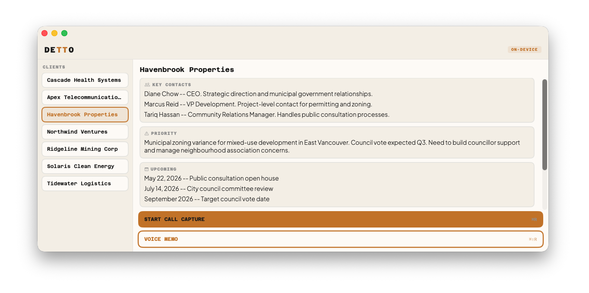
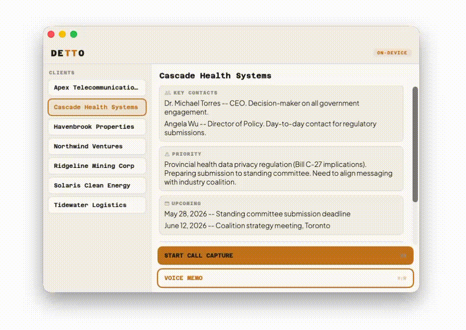
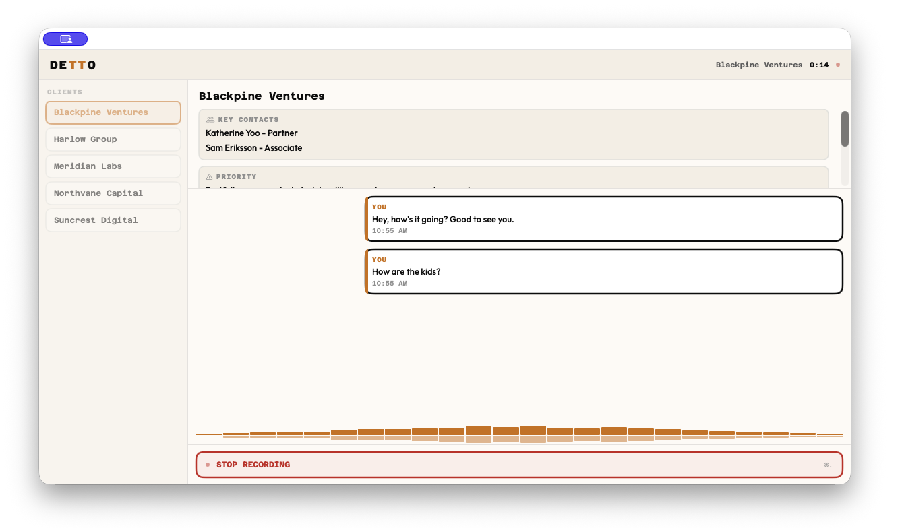
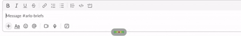
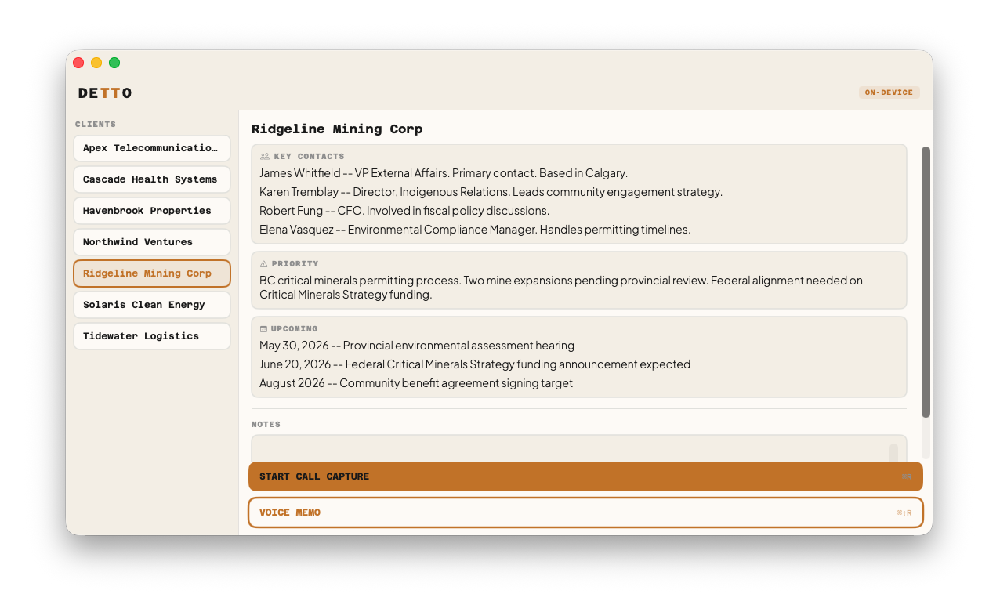
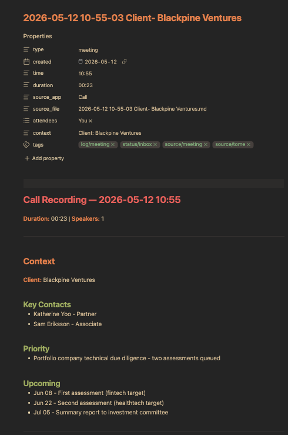

<h1 align="center">Detto</h1>

<p align="center">
  <strong>Hold a key, speak, release, text appears.</strong><br>
  Meetings. Voice memos. System-wide dictation. Nothing leaves your Mac.
</p>

<p align="center">
  
  
  
  
</p>

---

Detto is a macOS app for Apple Silicon. It captures meetings, takes voice memos, and gives you system-wide dictation, all running locally. ASR on the Neural Engine, text refinement on the GPU. After the initial model download, nothing leaves your Mac. Transcripts land as plain markdown with YAML frontmatter, ready for Obsidian, agents, backlinks, and whatever you build next.

<p align="center">
  
</p>

<p align="center">
  
</p>

## Why

I'm a consultant. I built an Obsidian vault as a second brain: structured notes with YAML frontmatter, backlinks, tags, and an AI agent layer that processes everything automatically. Client files, meeting notes, action items, daily briefs, all flowing through the vault.

The problem was capture. I'm on calls all day and I don't take notes. I needed something that would listen, transcribe, and drop structured markdown into the vault where my agents could pick it up. Pull out action items, update client files, connect the dots.

I looked at Otter, Granola, Fireflies. They all lock your data in their cloud, their format, their walled garden. None of them output plain markdown. None of them feed into an agent workflow. None of them work offline.

Detto exists because none of them did what I needed. Your voice, your Mac, your files.

## Philosophy

**Privacy is architecture, not a toggle.** There is no server. There is no account. There is no analytics SDK buried in the dependency tree. After the initial model download, the only network activity is optional Sparkle update checks against a static XML file on GitHub Pages. Everything else runs on your hardware.

**Vault-native output.** Every transcript is a plain `.md` file with YAML frontmatter. You own the files. Open them in Obsidian, VS Code, a text editor, or feed them to an agent pipeline. No proprietary format, no export step, no lock-in.

**On-device intelligence.** ASR runs on the Apple Neural Engine via Parakeet-TDT v3. Text refinement runs on the GPU via Llama 3.2 3B through MLX. Dictation uses a two-phase design: emit a transcript immediately, then refine in the background. That's what makes it feel instant while still producing clean output. Small local models won't match a frontier cloud model on polish. That's the trade for owning your voice.

**Capture without context is just noise.** Detto reads your client files before the call, surfaces contacts and priorities, embeds structured context into the transcript, and renames the output file so your vault stays organized without manual effort.

---

## Modes

### Call Capture

Grabs mic + system audio simultaneously during a call. Mic audio is labeled "You," system audio is labeled "Them" for clean channel-based speaker separation. The app detects which conferencing app is active (Teams, Zoom, Slack, Webex, Google Meet) and tags the transcript metadata accordingly. Output lands in your vault as a structured `.md` file with YAML frontmatter.

<p align="center">
  
</p>

### Voice Memo

Mic only. For quick thoughts, verbal notes, stream of consciousness. Saves to a separate folder so it doesn't clutter your meeting transcripts. Same structured output, same frontmatter.

### Dictation

Hold a hotkey to record, release to transcribe. Text gets injected at your cursor in whatever app you're using. Slack, email, a doc, a terminal. Works system-wide. Works offline.

**Transcription speed rivaling cloud alternatives. Zero bytes sent.**

<p align="center">
  
</p>

Configurable hotkeys: Left Control, Fn, Right Option, Right Command, Hyper Key, Ctrl+Option+Space, or any custom combo. Two activation styles: hold-to-speak (hold the key, release to transcribe) or toggle mode (double-tap to start, double-tap to stop).

A floating pill overlay shows recording state and a live waveform while you speak.

<p align="center">
  
</p>

---

## Client Briefing

<p align="center">
  
</p>

If you maintain client files in your vault, Detto reads them and turns the app into a pre-call briefing tool.

Point Detto at your vault root and it scans for markdown files with `type: client` frontmatter. The main window switches to a split layout: your clients on the left, a briefing panel on the right. Select a client before a call and you see their key contacts, current priority, and upcoming dates, all pulled live from the vault file. There's a notes field for jotting pre-call context that gets embedded into the transcript.

When you start a recording with a client selected, the transcript output includes a `## Context` section with the structured client data and your notes. The file gets renamed to include the client name. Most-used clients float to the top.

Without a client selected, the briefing panel shows a generic call form: attendees, topic, and notes. Fill in what you know before the call and it all gets saved into the transcript's context section.

Everything is configurable via a `.detto.yaml` in your vault root:

```yaml
clientsPath: Clients
clientType: client
sections:
  contacts: Key Contacts
  priority: Priority Item
  timeline: Operational Timeline
```

Defaults work out of the box if your client files live in `Clients/` with the headings above. Change the paths and headings to match whatever structure your vault already uses.

---

## On-Device Refinement

Raw ASR output has rough edges: missing capitalization, no punctuation, the occasional word-order glitch. Detto fixes this locally using Llama 3.2 3B (4-bit quantized) running on your GPU via [MLX](https://github.com/ml-explore/mlx).

The model downloads automatically on first launch (~2GB, cached after that). During dictation, Detto pre-warms the GPU cache while you're still speaking so refinement starts the instant you release the key.

---

## Custom Vocabulary

Detto ships with a bundled Canadian Politics pack that fixes common ASR errors during transcription. You can add domain-specific terms and corrections by pointing **Settings → Vocabulary → Custom Vocabulary** at a folder of `.txt` files.

```
# Terms - canonical spelling, applied via case normalization + fuzzy match
PostgreSQL
San Francisco

# Corrections - pattern on left, replacement on right
Post Grass = PostgreSQL
```

See [`ExampleVocabulary/`](ExampleVocabulary/) for a working file and the full format guide.

---

## Output

<p align="center">
  
</p>

```markdown
---
type: meeting
created: "2026-05-12"
time: "10:00"
duration: "18:42"
source_app: "Zoom"
source_file: "2026-05-12 10-00-00 Acme Corp.md"
attendees: ["You", "Them"]
context: "Client: Acme Corp"
tags:
  - log/meeting
  - status/inbox
  - source/meeting
  - source/detto
---

# Call Recording - 2026-05-12 10:00

**Duration:** 18:42 | **Speakers:** 2

---

## Context

**Client:** Acme Corp

### Key Contacts
- Jane Smith, VP Engineering
- Mike Chen, Product Lead

### Priority
- Q3 launch timeline at risk, waiting on vendor API

### Notes
Discuss revised timeline and fallback plan for vendor delay.

---

## Transcript

**You** (10:00:03)
Morning. Quick sync on the product launch. Where are we at?

**Them** (10:00:07)
We're in good shape. QA signed off yesterday, marketing assets
are locked, landing page is live in staging.
```

Voice memos use `type: fleeting` with a single speaker. Same structure, same frontmatter. Calls without a client selected include attendees/topic from the generic call form in the context section.

---

## Highlights

- **25 European languages**, auto-detected by ASR
- **Channel-based speaker separation**, mic audio labeled "You" and system audio labeled "Them"
- **Conferencing app detection** tags transcripts with the active app (Teams, Zoom, Slack, Webex, Google Meet)
- **Silence auto-stop** after 120 seconds of dead air
- **No audio saved to disk.** Audio buffers are discarded after each session, only text is kept.
- **Hidden from screen sharing** by default (toggle in Settings)
- **Auto-updates** via Sparkle with EdDSA signing

---

## Install

**Download:** Grab the latest DMG from [Releases](https://github.com/Gremble-io/detto/releases). Signed and notarized, drag to Applications.

**Build from source:**

```bash
git clone https://github.com/Gremble-io/detto.git
cd detto
./scripts/build_swift_app.sh
```

Requires Apple Silicon, macOS 26+, Xcode 26.3+. First launch downloads Parakeet ASR (~600MB) and Llama 3.2 3B (~2GB). Both are cached locally after the first download.

---

## Permissions

| Permission | When | Why |
|---|---|---|
| **Microphone** | All modes | Captures your voice |
| **Screen Recording** | Call Capture only | ScreenCaptureKit needs this for system audio from conferencing apps |
| **Accessibility** | Dictation only | Injects transcribed text at the cursor position |

All three are requested during onboarding so everything works when you start your first call.

---

## Architecture

```
Detto/Sources/Detto/
├── App/             Entry point, AppDelegate, Sparkle updates
├── Assets/          App icon variants
├── Audio/           Mic (AVAudioEngine) + system audio (ScreenCaptureKit)
├── Dictation/       Hotkey manager, text injection, floating overlay, state
├── Fonts/           Azeret Mono, Plus Jakarta Sans
├── Models/          Domain types, client registry, transcript store
├── Settings/        User preferences, security-scoped bookmarks
├── Storage/         Markdown output with YAML frontmatter, session persistence
├── Transcription/   Dual-stream capture, VAD, real-time ASR pipeline
└── Views/           SwiftUI: transcript, waveform, briefing, controls, settings
```

### GrembleVoice

GrembleVoice handles all speech and language processing. It's a standalone Swift package for end-to-end voice intelligence on Apple platforms, modular by design so you pull in only what you need.

| Module | Purpose |
|---|---|
| `GrembleVoiceCore` | Protocols, value types, text processing (zero dependencies) |
| `GrembleVoiceParakeet` | Parakeet-TDT v3 ASR, VAD, speaker diarization |
| `GrembleVoiceWhisper` | Whisper ASR via WhisperKit (alternative engine) |
| `GrembleVoiceRefinement` | On-device LLM refinement via MLX (Llama 3.2 3B) |
| `GrembleVoiceCloud` | BYOK cloud transcription + refinement (Claude, OpenAI, Groq) |
| `GrembleVoiceAudio` | AVFoundation audio capture and level metering |
| `GrembleVoiceEngine` | All-in-one pipeline facade |

Detto uses the Parakeet adapter for streaming ASR with VAD gating, channel-based speaker separation, and the MLX refiner for on-device text cleanup.

[GrembleVoice on GitHub →](https://github.com/Gremble-io/gremble-voice)

---

## Privacy

- **No audio saved to disk.** Audio buffers exist in memory during recording and are discarded immediately. Only text transcripts are kept.
- **No accounts.** No login, no cloud storage, no subscription.
- **Hidden from screen sharing** by default. The app window is invisible during screen share. Toggle in Settings if you want to show it.
- **Transcripts are plain files.** Saved as `.md` to a folder you choose. Move them, sync them, delete them. They're yours.

---

## Background

Detto started as Tome, a prototype I built to record consulting calls and drop transcripts into my Obsidian vault. I was new to Swift and the first version was a fork of [OpenGranola](https://github.com/yazinsai/OpenGranola).

I replaced every piece of it over time: new audio pipeline, local ASR instead of cloud, speaker diarization, on-device LLM refinement, vault-native output, system-wide dictation.

Detto is the rewrite. Clean architecture, a standalone speech engine ([GrembleVoice](https://github.com/Gremble-io/gremble-voice)), and a bet on where knowledge tooling is heading: process as much of your data as possible on your own hardware.

---

## Limits

- **Apple Silicon, macOS 26+.** No Intel Macs. No Windows. No Linux.
- **English refinement.** ASR auto-detects 25 European languages, but the Llama refiner is English-tuned. Other languages transcribe fine, just with less polish on punctuation and capitalization.
- **No sync.** Transcripts save to a folder you choose. iCloud, Dropbox, Obsidian Sync, whatever syncs that folder handles sync. Detto doesn't.
- **Single user.** No teams, no shared client files, no admin console. This is a personal tool.

---

## License

Detto is source-available under the [Business Source License 1.1](LICENSE). You can use it personally, build from source, and modify it. Commercial redistribution as a competing product is restricted. The license converts automatically to MIT on 2030-05-12.

The [GrembleVoice](https://github.com/Gremble-io/gremble-voice) engine is open source under [Apache 2.0](https://github.com/Gremble-io/gremble-voice/blob/main/LICENSE).

---

## Support the project

If Detto is useful to you, [sponsor on GitHub](https://github.com/sponsors/Gremble-io). It funds further work on local-first capture tooling.

Star the repo, file issues, send feedback. Always interested in how people are using it.

<p align="center">
  Your voice. Your Mac. No one listening.
</p>
